<h1 align="center">Awesome AndroidROM</h1>

   

#### Also Visit: [Awesome-CustomROM](https://github.com/ImKKingshuk/Awesome-CustomROM) to dive into a collection of the best Custom ROMs.

  

|                          Icon                          |    OEM Name    |         ROM Name         | Development Status | Latest Version |                                           Website                                            |
| :----------------------------------------------------: | :------------: | :----------------------: | :----------------: | :------------: | :------------------------------------------------------------------------------------------: |
|              |  **Asus ROG**  |        **ROGUI**         |       Active       |       14       |                        [Website](https://www.asus.com/in/content/ui/)                        |
|              | **BlackShark** |        **JoyUI**         |    Discontinued    |       13       |                                         [Website]()                                          |
|             | **Blackview**  |        **DokeOS**        |       Active       |       4        |                          [Website](https://promo.blackview.hk/os3/)                          |
|            |   **Gionee**   |       **AmigoOS**        |    Discontinued    |       5        |                                         [Website]()                                          |
|            |   **Google**   |       **Android**        |       Active       |       15       |                  [Website](https://www.android.com/intl/en_in/android-14/)                   |
|            |   **Honor**    |       **MagicOS**        |       Active       |       9        |                        [Website](https://www.honor.com/in/magic-os/)                         |
|               |   **Huawei**   |         **EMUI**         |       Active       |       15       |                      [Website](https://consumer.huawei.com/en/emui-13/)                      |
|     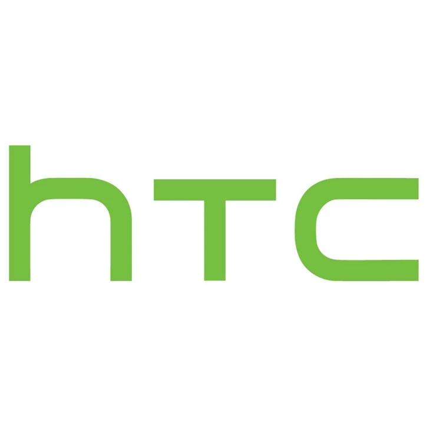      |    **Htc**     |      **Htc Sense**       |    Discontinued    |       11       |                  [Website](https://www.android.com/intl/en_in/android-14/)                   |
|                |  **Infinix**   |         **XOS**          |       Active       |       14       |                        [Website](https://www.infinixmobiles.in/xos/)                         |
|        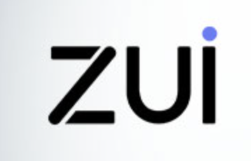        |   **Lenovo**   |         **ZUI**          |       Active       |       16       |                               [Website](https://m.zui.com/#/)                                |
|     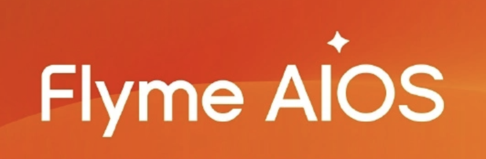     |   **Meizu**    |      **FlymeAIOS**       |       Active       |       12       |                            [Website](https://www.flyme.com/aios)                             |
|            |  **Motorola**  |       **HelloUI**        |       Active       |       2        |                          [Website](https://www.motorola.in/my-ux/p)                          |
|               |  **Motorola**  |         **MyUI**         |    Discontinued    |       13       |                          [Website](https://www.motorola.in/my-ux/p)                          |
|              |    **Nio**     |        **SkyUI**         |       Active       |       2        |                              [Website](https://phone.nio.com/)                               |
|    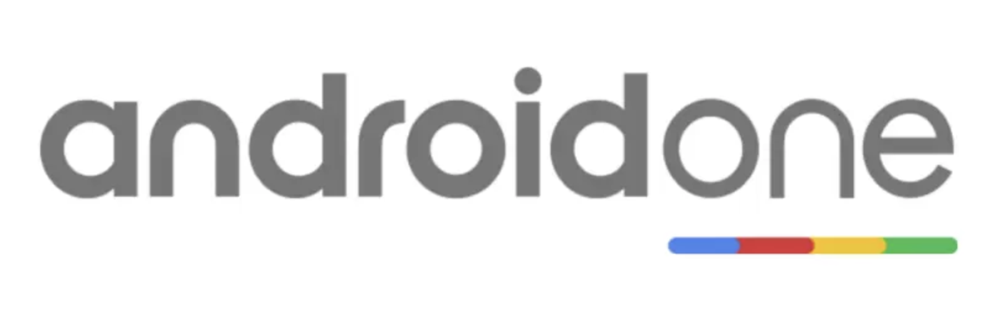     |   **Nokia**    | **PureUI (Android One)** |    Discontinued    |       12       |                           [Website](https://www.android.com/one/)                            |
|          |  **Nothing**   |      **NothingOS**       |       Active       |       3        |                                         [Website]()                                          |
|            |   **Nubia**    |       **NubiaUI**        |    Discontinued    |       8        |                                         [Website]()                                          |
|     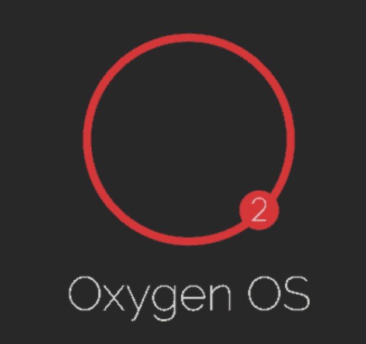      |  **OnePlus**   |       **OxygenOS**       |       Active       |       15       |                         [Website](https://www.oneplus.in/oxygenos14)                         |
|    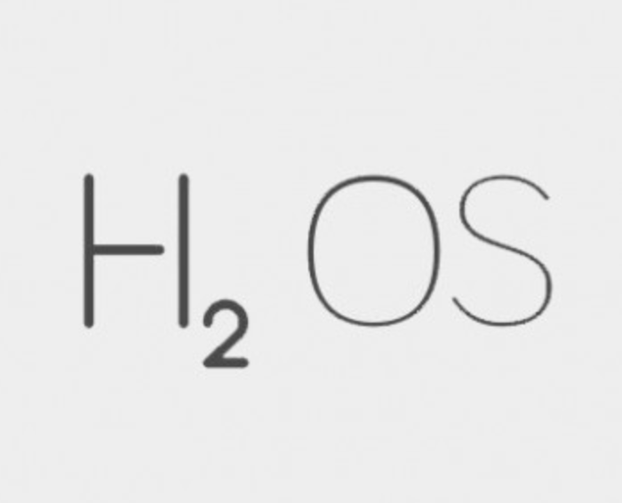     |  **OnePlus**   |      **HydrogenOS**      |    Discontinued    |       11       |                       [Website](https://www.oneplus.com/cn/hydrogenos)                       |
|      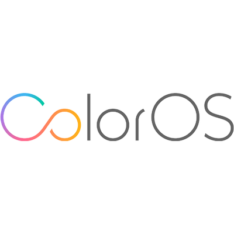      |    **Oppo**    |       **ColorOS**        |       Active       |       15       |                        [Website](https://www.oppo.com/en/coloros14/)                         |
|     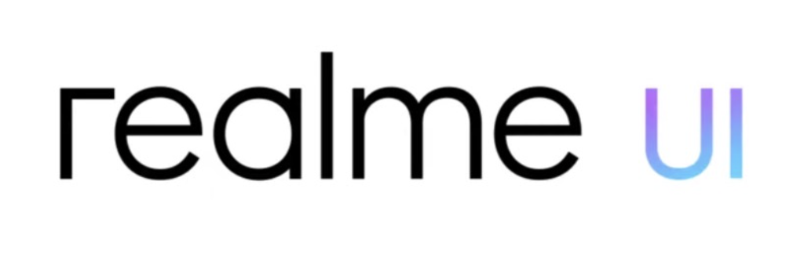      |   **Realme**   |       **RealmeUI**       |       Active       |       6        |                       [Website](https://www.realme.com/in/realme-ui-5)                       |
|         |  **Redmagic**  |      **RedmagicOS**      |       Active       |       10       |                                         [Website]()                                          |
|       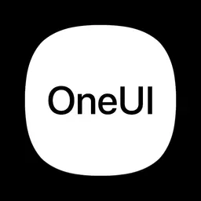       |  **Samsung**   |        **OneUI**         |       Active       |       7        |                        [Website](https://www.samsung.com/in/one-ui/)                         |
|  |  **Samsung**   |  **Samsung Experience**  |    Discontinued    |       10       |                        [Website](https://www.samsung.com/in/one-ui/)                         |
|     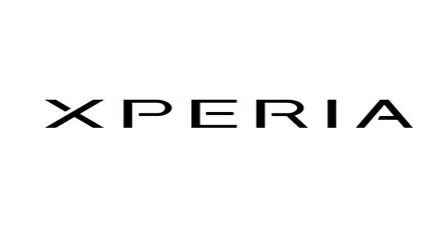      |    **Sony**    |       **XperiaUI**       |       Active       |       15       |                  [Website](https://www.android.com/intl/en_in/android-14/)                   |
|               |   **Techno**   |         **HiOS**         |       Active       |       14       |                     [Website](https://www.tecno-mobile.com/hios-detail/)                     |
|         |    **Vivo**    |      **FuntouchOS**      |       Active       |       15       |                         [Website](https://www.vivo.com/in/funtouch)                          |
|           |    **Vivo**    |       **OriginOS**       |       Active       |       4        |                         [Website](https://www.vivo.com.cn/originos)                          |
|      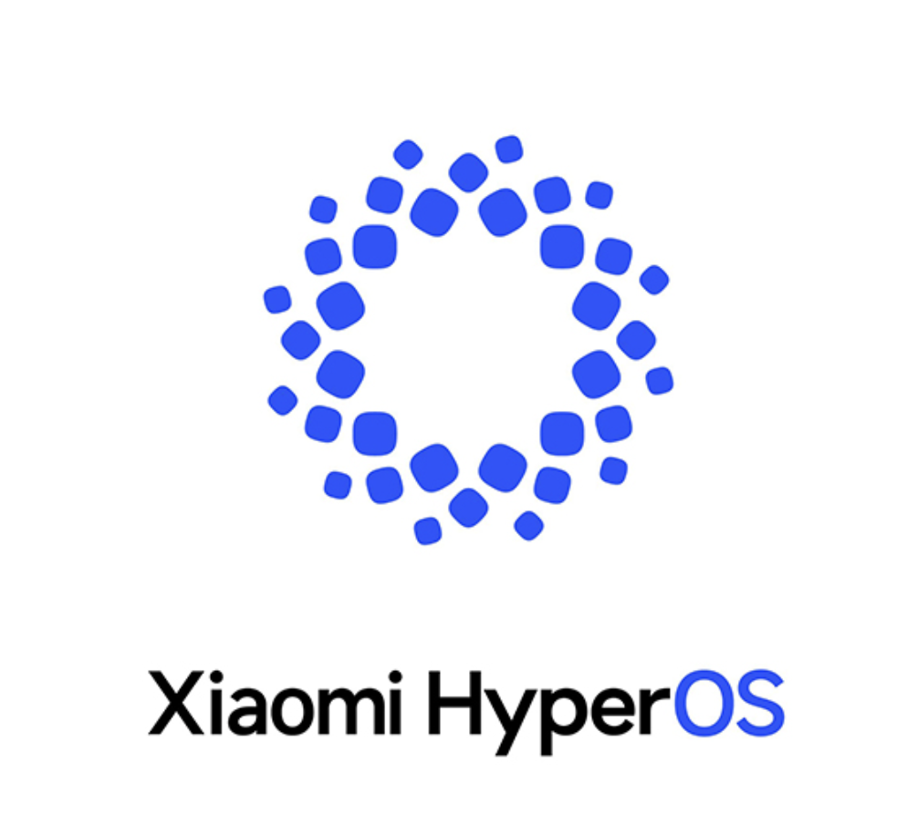      |   **Xiaomi**   |       **HyperOS**        |       Active       |       1        | [Website Global](https://www.mi.com/global/hyperos) [Website China](https://hyperos.mi.com/) |
|       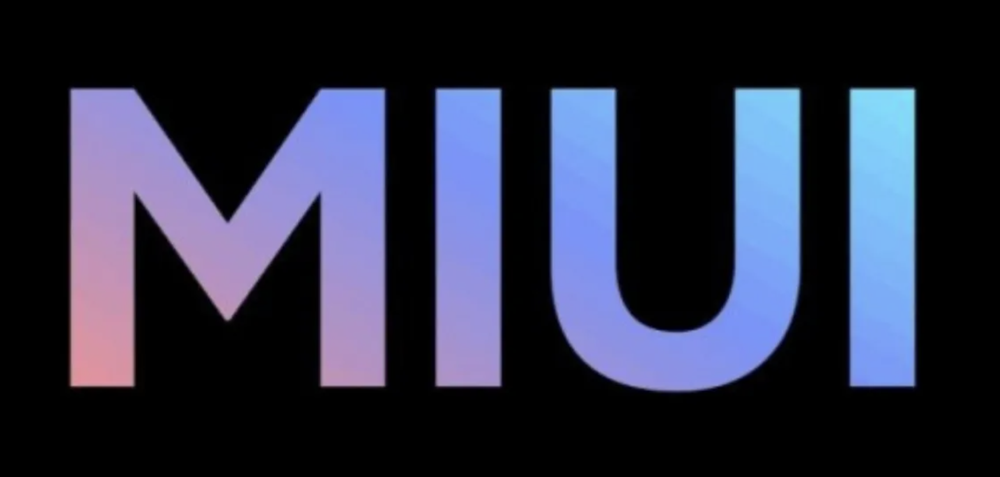        |   **Xiaomi**   |         **MIUI**         |    Discontinued    |       14       |  [Website Global](https://www.mi.com/global/miui) [Website China](https://home.miui.com/14)  |
|       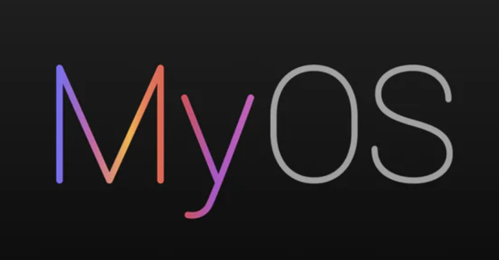        |    **Zte**     |         **MyOS**         |       Active       |       14       |                        [Website](https://www.ztedevices.com/cn/myos/)                        |
